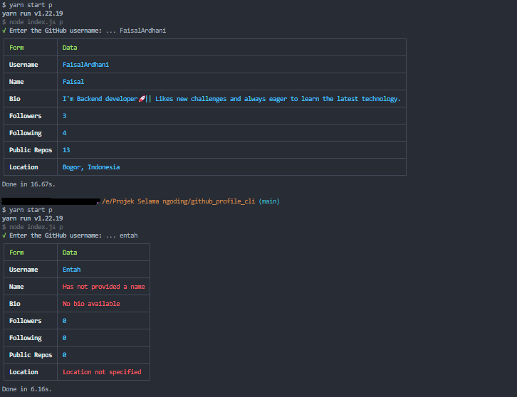

Certainly! Here's a cool and informative README for your GitHub Profile CLI project:

---

<div align="center">
  
</div>

# GitHub Profile CLI

A Command Line Interface (CLI) tool to fetch and display GitHub user profiles using Node.js.

## Table of Contents

- [Introduction](#introduction)
- [Features](#features)
- [Installation](#installation)
- [Usage](#usage)
- [Command Reference](#command-reference)
- [Contributing](#contributing)
- [License](#license)

## Introduction

GitHub Profile CLI is a handy utility built with Node.js that allows you to quickly retrieve and view GitHub user profiles directly from your terminal. It utilizes the GitHub API to fetch information such as username, name, bio, followers, following, and public repository count for a specified GitHub user.

## Features

- Fetch and display GitHub user profile information.
- Easy-to-use CLI with clear command syntax.
- Minimal setup and installation.

## Installation

1. Ensure you have [Node.js](https://nodejs.org/) installed.
2. Clone this repository or download the ZIP file.
3. Open a terminal and navigate to the project directory.
4. Run the following command to install the required dependencies:

   ```bash
   yarn install
   ```

## Usage

To use the GitHub Profile CLI, follow these steps:

1. Open a terminal.
2. Navigate to the project directory.
3. Run the CLI command followed by the GitHub username:

   ```bash
   node index.js profile <username>
   ```

   Example:

   ```bash
   node index.js profile octocat
   ```

## Command Reference

- `profile <username>` or `-p <username>`: Fetch and display the GitHub profile of the specified username.

## Contributing

Contributions are welcome! To contribute to the GitHub Profile CLI project, follow these steps:

1. Fork the repository.
2. Create a new branch for your feature or bug fix.
3. Commit your changes and push to your fork.
4. Open a pull request describing your changes.

Please ensure you adhere to the [Code of Conduct](CODE_OF_CONDUCT.md) and follow the [Contribution Guidelines](CONTRIBUTING.md).

## License

This project is licensed under the [MIT License](LICENSE).

---